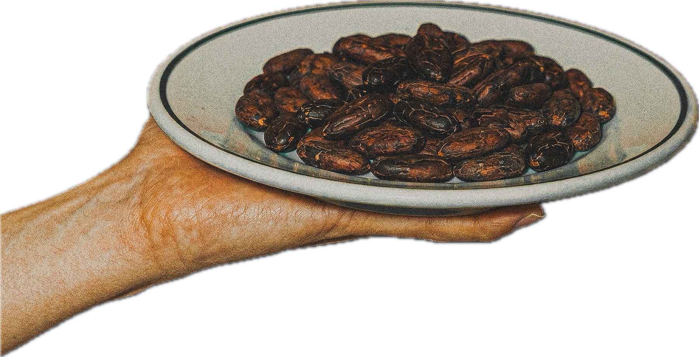

<div align="center">

# Cacao — Personal Introduction Website

A refined single-page landing site built with zero external dependencies.


</div>

---

## Table of Contents

- [Page Structure](#page-structure)
- [Directory Layout](#directory-layout)
- [Getting Started](#getting-started)
- [Section Specs](#section-specs)
- [Tech Stack](#tech-stack)
- [Swapping Images](#swapping-images)

---

## Page Structure

| # | Section | Description |
|:-:|---------|-------------|
| 1 | **Top** | Hero view — text slides top→down, image slides bottom→up on load |
| 2 | **Introduction** | Self-introduction card with EN / JA language toggle |
| 3 | **My Hobby** | 3×2 bento-grid hobby showcase |
| 4 | **Portfolio** | Stacked-card grid with fan-spread hover effect |
| 5 | **Achievement** | Career & milestone timeline |
| 6 | **My SNS** | X (Twitter) and Zenn link cards |

<details>
<summary>日本語で読む</summary>

| # | セクション | 概要 |
|:-:|-----------|------|
| 1 | **Top** | ファーストビュー。テキスト上→下・画像下→上スライドイン |
| 2 | **Introduction** | 自己紹介文（英語 / 日本語 切替対応） |
| 3 | **My Hobby** | 趣味紹介（3×2 ベントグリッドレイアウト） |
| 4 | **Portfolio** | 制作物一覧（スタックカードホバーエフェクト） |
| 5 | **Achievement** | 経歴・実績タイムライン |
| 6 | **My SNS** | X（Twitter）・Zenn リンクカード |

</details>

---

## Directory Layout

```
_myweb_/
├── index.html                  # Main page (all sections)
├── css/
│   └── style.css               # All styles
├── js/
│   └── script.js               # Language toggle & scroll animations
├── sample_images/
│   ├── dish_cacao.png          # Hero section right-column image
│   ├── IMG_9048.jpg            # My Hobby: Golf
│   ├── IMG_5807.jpg            # My Hobby: Sauna
│   ├── IMG_7958.jpg            # My Hobby: Overseas travel
│   └── readme.png              # README preview screenshot
├── documents/
│   └── 設計書.md               # Design specification document
├── package.json                # npm script definitions
├── start.sh                    # Local server launch script
└── README.md                   # This file
```

<details>
<summary>日本語で読む</summary>

```
_myweb_/
├── index.html                  # メインページ（全セクション）
├── css/
│   └── style.css               # 全スタイル定義
├── js/
│   └── script.js               # 言語切替・スクロールアニメーション
├── sample_images/
│   ├── dish_cacao.png          # トップページ右側の画像
│   ├── IMG_9048.jpg            # My Hobby: Golf 画像
│   ├── IMG_5807.jpg            # My Hobby: Sauna 画像
│   ├── IMG_7958.jpg            # My Hobby: Overseas travel 画像
│   └── readme.png              # README プレビュー画像
├── documents/
│   └── 設計書.md               # WEBサイト設計仕様書
├── package.json                # npm スクリプト定義
├── start.sh                    # ローカルサーバー起動シェルスクリプト
└── README.md                   # このファイル
```

</details>

---

## Getting Started

### Option 1 — Shell script *(recommended)*

Works on macOS / Linux with Python 3 pre-installed.

```bash
./start.sh
```

Then open your browser at `http://localhost:3000`.

### Option 2 — Python 3 directly

```bash
python3 -m http.server 3000
```

### Option 3 — npm *(requires Node.js)*

```bash
npm start
```

> `npm start` uses `npx serve` internally. On first run you may be prompted to install the `serve` package — enter `y` to proceed.

To stop the server, press `Ctrl + C` in the terminal.

If the server is still running in the background (e.g. the terminal was closed without stopping it), force-kill it with:

```bash
kill $(lsof -ti :3000)
```

<details>
<summary>日本語で読む</summary>

### 方法 1：シェルスクリプト（推奨）

Python3 が標準搭載の macOS / Linux で動作します。

```bash
./start.sh
```

起動後、ブラウザで `http://localhost:3000` にアクセスしてください。

### 方法 2：Python3 コマンド直接実行

```bash
python3 -m http.server 3000
```

### 方法 3：npm スクリプト（Node.js が必要）

```bash
npm start
```

> `npm start` は内部で `npx serve` を使用します。初回実行時に `serve` パッケージのインストール確認が表示される場合があります。`y` を入力してインストールを許可してください。

サーバーを停止するには、ターミナルで `Ctrl + C` を押してください。

ターミナルを閉じるなどしてサーバーがバックグラウンドで残っている場合は、以下のコマンドで強制終了してください。

```bash
kill $(lsof -ti :3000)
```

</details>

---

## Section Specs

### Top (Hero)

- Left column: caption text `I'm Cacao`
- Right column: `dish_cacao.png`
- Text slides top→down on page load (`translateY(-60px)` → `0`)
- Image slides bottom→up on page load (`translateY(60px)` → `0`)

### Introduction

- Defaults to English text
- Clicking **"Translate into Japanese"** (bottom-right of card) switches to Japanese
- Click again to revert — animated with a fade transition

### My Hobby

- 3-column × 2-row bento grid layout
- Image cells scale to `1.06` on hover
- Sauna text cell uses a dark background (`#2d2419`)

```
┌─────────────┬───────────────┬─────────────┐
│  Golf img   │  Golf text    │  Sauna img  │
├─────────────┼───────────────┼─────────────┤
│ Sauna text  │  Travel img   │ Travel text │
└─────────────┴───────────────┴─────────────┘
```

### Portfolio

- 2-column × 2-row grid (4 items total)
- Each item renders 3 stacked cards
- Hover spreads the stack in a fan-out animation
- Center label: `Coming Soon`

### Achievement

- Timeline layout: year label on the left, content on the right
- Current item highlighted in accent color (cacao brown `#6B4226`)

### My SNS

| Platform | URL |
|----------|-----|
| X (Twitter) | https://x.com/cacaobucks |
| Zenn | https://zenn.dev/cacao_devlog |

<details>
<summary>日本語で読む</summary>

### Top（ヒーロー）

- 左カラムにテキスト `I'm Cacao` を表示
- 右カラムに `dish_cacao.png` を表示
- テキスト：ページ読み込み時に上から下へスライドイン（`translateY(-60px)` → `0`）
- 画像：下から上へスライドイン（`translateY(60px)` → `0`）

### Introduction

- デフォルトで英語テキストを表示
- カード右下の **「Translate into Japanese」ボタン** をクリックすると日本語に切り替わる
- 再クリックで英語に戻る（フェードトランジション付き）

### My Hobby

- 3 列 × 2 行のベントグリッドレイアウト
- 画像セルにマウスオーバーで `scale(1.06)` の拡大エフェクト
- Sauna テキストセルはダーク背景（`#2d2419`）

```
[Golf 画像  ] [Golf テキスト ] [Sauna 画像 ]
[Sauna テキスト] [Overseas travel 画像] [Overseas travel テキスト]
```

### Portfolio

- 2 列 × 2 行のグリッド（計 4 アイテム）
- 各アイテムは 3 枚のカードをスタック表示
- マウスオーバーでカードが扇状に広がるホバーエフェクト
- 各カードの中央に `Coming Soon` を表示

### Achievement

- 左側に年表ラベル、右側に内容を配置するタイムライン形式
- 「Currently（現在）」のアイテムはアクセントカラー（カカオブラウン `#6B4226`）でハイライト

### My SNS

| プラットフォーム | URL |
|----------------|-----|
| X（Twitter） | https://x.com/cacaobucks |
| Zenn | https://zenn.dev/cacao_devlog |

</details>

---

## Tech Stack

| Layer | Detail |
|-------|--------|
| **HTML** | HTML5 semantic markup |
| **CSS** | CSS3 · Custom Properties · Grid · Flexbox · Keyframe Animations |
| **JavaScript** | Vanilla JS (ES2020) · `IntersectionObserver` API |
| **Font** | `-apple-system` (San Francisco on iOS / macOS) |
| **Icons** | Inline SVG |
| **Dependencies** | None — local server via `serve` or Python 3 |

<details>
<summary>日本語で読む</summary>

| 種別 | 内容 |
|------|------|
| **HTML** | HTML5 セマンティックマークアップ |
| **CSS** | CSS3 / CSS Custom Properties / CSS Grid / Flexbox / Keyframe Animation |
| **JavaScript** | Vanilla JS（ES2020）/ `IntersectionObserver` API |
| **フォント** | `-apple-system`（iOS / macOS の San Francisco フォント） |
| **アイコン** | SVG インライン |
| **外部依存** | なし（ローカルサーバーに `serve` または Python3 を使用） |

</details>

---

## Swapping Images

### Hero image

Replace `sample_images/dish_cacao.png` with a file of the same name, or update the `src` attribute in `index.html`:

```html

```

### My Hobby images

| Section | Current file | Where to edit |
|---------|-------------|---------------|
| Golf | `IMG_9048.jpg` | `src` of `alt="Golf course"` in `index.html` |
| Sauna | `IMG_5807.jpg` | `src` of `alt="Sauna facility"` in `index.html` |
| Overseas travel | `IMG_7958.jpg` | `src` of `alt="Overseas travel"` in `index.html` |

### Adding Portfolio works

To replace a `Coming Soon` card, add content inside `.card--1` within the relevant `.card-stack` in `index.html`, then extend `.card__label` in `css/style.css`.

<details>
<summary>日本語で読む</summary>

### トップページ画像の変更

`sample_images/dish_cacao.png` を同名の別ファイルに差し替えるか、`index.html` 内の `src` 属性を変更してください。

```html

```

### My Hobby セクションの画像変更

| セクション | 現在のファイル | 変更箇所 |
|-----------|--------------|----------|
| Golf | `IMG_9048.jpg` | `index.html` 内 `alt="Golf course"` の `src` 属性 |
| Sauna | `IMG_5807.jpg` | `index.html` 内 `alt="Sauna facility"` の `src` 属性 |
| Overseas travel | `IMG_7958.jpg` | `index.html` 内 `alt="Overseas travel"` の `src` 属性 |

### Portfolio の作品追加方法

`Coming Soon` カードに作品を追加する場合、`index.html` の各 `.card-stack` 内の `.card--1` にタイトルや画像を追加し、`css/style.css` の `.card__label` を拡張してください。

</details>
